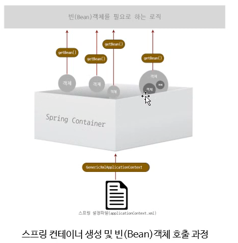
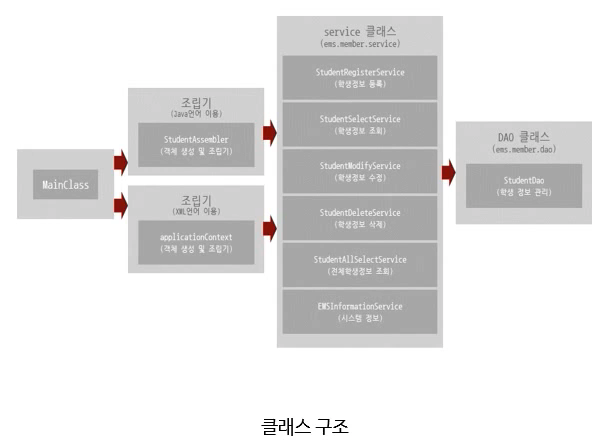

# Spring 

> 스프링을 공부하며 `중요한 부분이나 기억해야할 부분` 들을 정리하였습니다.

<br>

### 폴더관리 


> (/src/main/java, /src/main/resources)
* java 폴더의 경우 특별한 것은 없고, 앞으로 만들어지는 자바 파일들이 관리되는 폴더이다.
* resources 폴더의 경우 자원을 관리하는 폴더로 스프링 설정 파일(xml)ㄷ 또는 프로퍼티 파일 등이 관리된다.
* java, resources 폴더는 스프링 프레임워크의 기본 구조를 이루는 폴더로 개발자는 이대로 폴더를 구성해야 한다.

<br>

###  pom.xml 파일

* pom.xml 파일은 메이븐 설정파일로 메이븐은 라이브러리를 연결해주고, 빌드를 위한 플랫폼이다.
*  pom.xml에 의해서 필요한 라이브러리만 다운로드 해서 사용한다.
* 라이브러리는 아래의 경로에서 확인 가능함
* .m2/repository/org/springframework
    * 참고로 모듈의 라이브러리 파일명은 artifactid  +"-"+버전명+".jar"로 표시된다.

<br>

### applicationContext.xml
* 스프링은 메모리 생성될때 스프링 컨테이너는 ioc를 큰 그릇을 만들고 거기에 객체를 생성해놓고 필요할 때 마다 가져감
* 스프링의 객체(bean을 만들어주는 것)를 생성헤 spring container 에 로딩함
* 내가 사용하려는 태그들에 대한 네임스페이스가 들어있음 
* oop 언어에서 처럼 new로 객체를 생성을 안해도 자동으로 객체(bean)를 생성해서 컨테이너에 담아줌
* xml 말고도 annotation으로 생성을 함

<br>

### GenericXml ApplicationContext
* ApplicationContext 컨테이너에 접근하기 위한 데이터 타입

<br>

### local에서 spring 프로젝트 만들기
* 프로젝트명
    * src
        * main
            * java
                * 클래스 생성
            * resources
                * applicationContext.xml
    * pom.xml
        * 내용은 기존의 것 복붙해서 사용
        * groupid랑 artifacts(프로젝트명)만 변경
        
<br>

### DI(의존주입)
* 스프링만의 기능은 아니고 oop에서의 방법론 중의 하나임,, java jsp 등등 에서 사용
* 큰 객체 안에 다른 객체가 들어있는 것
    * 자동차 안에 배터리 와 같은,,, 
* 스프링 컨테이너 생성 및 빈(bean) 객체 호출 과정
* 모든 객체가 한 db를 사용하는 것과 같은 방식
    * 한개의 dao를 여러 service가 참조하도록 한다.
	<center></center>		
	<center></center>
        
<br>

### Dao
* 스프링은 dao객체를 이용해서 db와 통신을 함 

<br>

### 의존객체 주입 방법

#### 1. 생성자를 이용한 의존 객체 주입
<center></center>	

#### 2. setter를 이용한 의존 객체 주입 (규칙주의)
<center></center>		

#### 3. List  타입 의존 객체 주입 
<center></center>		

#### 4. Map타입 객체 주입   
<center></center>		

<br>

### 스프링 설정 파일 분리
- 분리 기준
	- dao 객체와 service 객체를 만드는 애
	- db 와 관련된 부분을 dev서버와 real 부분으로 분리
	- informationservice의 정보만 담은 설정파일
* 보통 기능별로 분리를 많이 한다.
* 분리 후 import해서 사용할 수 도 있음
<center></center>		
* 주로 배열로 사용하는 방법 많이 쓴다.
<center></center>		
	
<br>

### bean의 범위
* 싱글톤 : 디폴트, 객체 하나만 생성
<center></center>		
* 원하면 프로토타입으로도 설정 가능 : 호출할때마다 (getbean)같은 객체타입이지만 다른 객체가 생성됨        
<center></center>		

<br>
 
### Dao
* insert
* select 
* update
* delete

<br>

### 의존객체 자동 주입
--> 자동으로 설정되어서 의존설정을 해주는 것
스프링 설정 파일에서 의존 객체를 주입할 때 <constructor-org> 또는 <property> 태그로 의존 대상 객체를 명시하지 않아도 스프링 컨테이너가 자동으로 필요한 의존 대상 객체를 찾아서 의존 대상 객체가 필요한 객체에 주입해주는 기능
```
* @Autowired
    * 주입하려는 객체의 (데이터) 타입이 일치하는 객체를 자동으로 주입한다.
    * 명시해야 할 것들
        * <context:annotation-config/>
        * namespace
        * schema
    * 생성자에 쓸 땐 그냥 쓰면 됨
    * 프로퍼티나 메소드에 쓰고 싶으면 디폴트 생성자를 명시 해줘야함
```
```
* @Resource
    * 주입하려는 객체의 이름이 일치하는 객체를 자동으로 주입한다.
    * 생성자엔 쓰지 못함, 프로퍼티나 메소드에 사용
```

<br>

### 의존객체 선택
동일한 객체가 2개 이상인 경우 스프링 컨테이너는 자동 주입 대상 객체를 판단하지 못해서 Exception을 발생시킨다.
```
--> @Qualifier를 사용한다(우선자)     
*     property 이름과 bean의 id가 같으면 안써도 괜찮음, 에러 안발생, 자동주입됨
* 의존객체 자동 주입 체크
    * @Autowired(required=false)
        * 의존 객체가 있으면 주입하고, 없으면 false를 주어라(냅둬라)
        * 거의 쓰진 않지만 이런 경우도 있음
```
```
* @Inject
    * @Autowired와 동일하나 required를 지원 안함
    * 얘 보단 @Autowired가 더 많이 쓰임
    * @Named로 id 속성값을 넣어 체크 한다. (Qualifier와 비슷함) 
    <center></center>
```
- 객체를 가지고 있는 프로그램들은 생명주기를 가짐
- 스프링 컨테이너와 빈객체의 생성, 종료시점은 동일하다. (생명주기가 같다)

<br>

### 스프링컨테이너 생명주기
<center></center>
<br>

### 빈 객체 생명주기
<center></center>

<br>

### 객체 생성, 소멸 시점에 특정 작업을 하고 싶은 경우
* InitializingBean에서 afterPropertiesSet()(빈 객체 생성시점에 호출됨)를, DisposableBean에서 destroy()(빈 객체 소멸시점에 호출됨)를 상속받아서 특정 작업을 할 수 있다.
    * 애네들이 생성되고 소멸되는 시점에 뭘 하고 싶다! 면 이런 인터페이스를 이용해서 메소드들을 만들어서 수행한다.
* init-method, destroy-method 속성을 사용한다.  
	<center></center>

<br>

### Anotation을 이용한 스프링 설정 (xml을 이용하지 않고 java의 어노테이션을 사용해서)

>  스프링 설정파일 인 xml 파일을 java 파일로 변경하기
#### @Configuration & @Bean 사용
    * 스프링 설정파일로서 xml 파일을 대신해서 컨테이너 생성 가능
    * configcontext 생성하는 방법(xml vs java)
    
<center></center>
<center></center>

#### DI 
<center></center>

#### property 
<center></center>

#### property가 list나 map일 경우 
<center></center>

<br>

### java 설정 파일도 유지보수의 용이를 위해 분리할 수 있음
* 개발 스트레스 줄이기 위함
* 일반적인 분리법 ( 기능별로)
    * db와 연결돠는 Dao
    * db 관련 기능들
    * Service
    * Util
* 다른 config파일의 빈 객체 참조할 때 
    * 이렇게 바꾼 후 메소드 말고 프로퍼티의 레퍼런스만 입력하면 됨
* 그 다음 이렇게 필요한 설정파일들 배열 타입으로 나열해서  import 하면 됨 

<br>

### 참조되지 않는 패키지 지우는 단축키 
* ctrl + shift + o

<br>

### import 어노테이션

* 분리한 파일들을 나열하는게 아니라 한 파일에 import 해놓은 후 그파일만 명시해서 코드를 간단하게
* config1에 다른 config 파일들 import 후 config1 파일만 명시한다.
* 개발 문화에 따라 자주 쓸 수도, 그냥 배열형으로 쓸 수 도 있음

### 용어 정리
- service : 기능
- Dao : database와 연결, 관계 짓는 녀석
- jsp : 사용자에게 실제로 보여줄 view

<br>

## 13 웹 프로그래밍 설계 모델

<br>

### 웹 프로그래밍을 구축하기 위한 설계 모델
* model1 
    * request 받으면 was에서 처리하고 필요한 데이터 db접근하고 그 데이터를 가공해서 ui 형태로 이쁘게 response(html형태로) 한다
    * was에서 사용자로부터 받은 request 에 대한 
        * -service : 기능
        * -Dao : database와 연결, 관계 짓는 녀석
        * -jsp : 사용자에게 실제로 보여줄 view
    * 를 모듈화 시키지 않고 하나의 파일로 처리해버리는 형태
    * 한 문서 안에 html, java, 각종 태그들 다 있음
    * 장점 : 다 몰아서 때려녛기 때문에 개발 속도는 빠름
    * 단점 : 유지보수가 어려움, 스트레스 가중
* model2 
    * model1의 단점을 보완하기 위함
    * 클라이언트가 서버에 request하면 그 요청을 controller 가 받음, controller 가 어떤 service한테 다음 작업을 시킬 까를 controll해주는 것. 얘를 따로 만들어서 모듈화 함
    * service도 기능별로 모듈화
    *  데이터베이스 접근 필요시 dao모듈을 따로 만들고 model이라는 객체를  이용해서 db와 통신 
    *  controller 에서 사용자에게 응답해주기 위해 view를 만들어서 (보통 jsp로 만듬) 얘를 가지고 클라이언트에 response 해준다
    * mvc를 기반으로 한다. 모듈별로 철저히 구분
        * model ( db와 관련된 data)
        * view
        * controller
        * --> 유지보수가 수월해진다!
    * 거의 모든 web application에서는 model2를 따른다. (spring 에서도 마찬가지)

<br>

### 스프링 MVC프레임워크 설계 구조
> web application을 만들기위한 기본적인 객체들
* 굉장히 중요하고 머리에 똭 담고 있어야 한다!!!!!!
* 플로우
    * 클라이언트에서 요청을 하면 DispatcherServlet에서 그 요청을 받는다. (클라이언트로 들어오는 요청의 첫 관문)
    * 1.요청을 받아서 HandlerMapping이라는 녀석한테 던진다.
    * Handlermapping 은 컨트롤러가 여러개 있을 수가 있는데 그 중 가장 적합한 컨트롤러를 선택해준다.
    * 다시 handlermapping 에서 DispatcherServlet으로 돌아온다
    * 2. 그럼 dispatcherservlet은 handleradapter라는 것에 요청을 한다. 컨트롤러가 있으면 컨트롤러 객체는 굉장히 많은 메소드를 가질 수 있는데 그 컨트롤러 안의 메소드 중 사용자가 요청한 것을 처리하기 적합한 메소드를 찾는다. 그다음 그 메소드의 처리 결과, 데이터를 model이라는 데이터로 가져온다.
    * 3. 컨트롤러를 거치고 다시 dispatcherservlet으로 돌아오면 dispatcherservlet은 다시 view resolver를 또 찾는다. 얘는 그냥 html코드의 view라고 생각하면 됨
    * 이때는 컨트롤러로부터 모든 작업이 끝났다고 보면 됨(뒷단 작업 service, dao, db 등)
    * dispatchservlet이 뷰에 해당하는 가장 적합한 jsp문서를 찾아달라고 하면서 viewresolver에게 보내면 4. 적합한 뷰(jsp페이지)를 찾아서 응답을 한다. 5. 이 응답이 클라이언트에게 끊어짐

<br>

### DispatcherServlet 설정
* dispatcherservlet : 사거리의 신호등과 같다. 조절해주는 애니까.
    * 처음에 웹어플리케이션 개발시 설정해줘야함. web.xml에서 서블릿 등록 후 스프링 설정파일 설정!!! 이게 생소하면 jsp, servlet에 대한 공부를 해보즈아

* web.xml -> 웹 설정을 하는 파일
    * 얘의 서블릿 등록하는 부분에 dispatherservlet 을 등록한다.
    * 얘안에 init parameter로 servlet-context.xmlI(스프링설정파일)을 설정해주면 스프링 컨테이너가 만들어지고 handler mapping, handleradapter, viewresolver 같은 애들은 컨테이너에 자동으로 생성이 된다. (다 스프링 프레임워크 패키지에 있는 녀석들임. 내가 작업해야할 것은 controller와 view...)
        * 만약 이것을 설정하지 않으면 자동으로 스프링 프레임워크가 생성해준다. appServlet-context.xml을 자동으로 설정함.
        * 일반적으로는 개발할 때에  설정을 다 해주는 편

<br>

### Controller 객체 @Controller
* controller에서 나와 다시 dispatcher에 보내지는 응답은 model에서 나온 객체의 결과와 view에서 나온 객체의 결과로 나뉠 수 있다.
* controller는 자동생성이 안되어서 개발자가 직접 만들어야함
    * annotation-driven 태그를 사용해서
    * controller 객체로 사영할 클래스를 @Controller 어노테이션을 사용해서 정의한다. 이걸 하기 위해서는 스프링 설정파일에 꼭 annotation-driven 태그를 써줘야함
    * controller는 클래스이다

<br>

### Controller 객체 @RequestMapping
* handleradapter 에 의해 어떠한 메소드가 동작을 해야할지 찾을때 @RequestMapping(요청한 값 명시를 해준다.) 를 사용
    * url: 도메인/contextpath/요청한 값
* 그럼 요청이 들어왔을때 요청한값에 대한 메소드를 실행함

<br>

### Controller 객체 Model 타입의 파라미터
* controller 뒤에 service, dao, db가 있을 수 도 있는데 얘네에서 작업 다하고 올리는 결과에 사용되는 객체 중 model & view 가 있다. 다 작업이 된 model을 받기 위한 파라미터. 모델객체에 데이터를 담아서 전달, 전달된 모델 데이터는 뷰에서 가공돼서 전달됨

<br>

### View 객체
* 사용자에게 응답해주기 위해 viewresolver객체에 위임을 하고 얘는 internalResourceViewResolver 빈 객체를 생성 후 해당하는 적합한 뷰를 찾는다.
    * 찾는 방법 : 컨트롤러 안에 매핑되는 메소드의 리턴값과  internalResourceViewResolver에서 만들어준 prefix 값 + 리턴되는 값 + suffix 값을 합쳐서 그 파일을 찾고 응답해줄 뷰를 만든다. 

<br>

### 전체적인 웹프로그래밍 구조
- 일단은 가볍게 넘어가돼 설계구조에 대해서는 꼭 잘 알아두고, dispatchservlet등록, 스프링 설정파일 등록 등등 위에서 나온 부분 다 숙지해두기.
- view : 프론트앤드
- controller : 백앤드

<br>

## 14 스프링 mvc 웹서비스
 실무에서는 웹서버를 따로 만들고 그 안에 웹 컨테이너로 톰켓을 이용
톰켓은 웹서버와 웹 컨테이너를 동시에 제공함

<br>

### 스프링 MVC 프로젝트 전체 구조

<br>

- @Controller
	* 보안 처리를 위한 것들은 post 방식으로 전달, 아니면 GET
    	* post 방식 사용시 @RequestMapping 에 method=RequestMethod.POST 명시해줘야함
- @Service // 서비스만 
	- 다른 곳에 명시할 필요 없이 어노테이션 하나로 Service 정의 할 수 있음
- @Component = @Resource = @Repository // 비슷

<br>

### @ModelAttribute
19강
: 모델의 닉네임 설정하는 것
* 어떤 메소드가 실행 되던 간에 @ModelAttribute가 붙은 메소드 들은 무조건 실행된다. 같이 실행되어서 써먹을 수 있다.
 
<br>

### Model & ModelAndView
* Model 은 뷰에 데이터만을 전달하기 위한 객체이고, ModelAndView는 데이터와 뷰의 이름을 함께 전달하는 객체
* 

<br>

### 세션과 쿠키 (JSP, Servlet와 비슷, 동일)
* 클라이언트와 서버가 연결을 유지할 수 있도록 하는 것
* Connectionless Protocol : 웹서비스는 HTTP 프로토콜을 기반으로 하는데, HTPP 프로토콜은 클라이언트와 서버의 관계를 유지하지 않는 특징이 있다. 요청 --> 응답 후 바로 연결 해지. 효율적
    * 문제점 : 로그인이나 상품 주문 요청 시 매번 연결이 끊기면 비효율적임
        * --> 세션과 쿠키를 이용하여 해결
* 세션 : 서버에서 연결 정보를 관리
    * 세션 생성
        * HttpServletRequest 
        * HttpSession  (더 간결)
        * 
        * 둘다 똑같다.
    * 세션 삭제
        * 로그아웃, 회원 탈퇴 시
        * session.invalidate();
    * 세션 주요 메소드
    * 세션 플로우
* 쿠키 : 클라이언트에서 연결 정보를 관리
    * 사용자의 로컬 컴퓨터 정보가 남는다.
    * 쿠키의 생성
    * 쿠키의 사용  
    * 한번 맺은 정보를 가지고 계속 연결 함
* 실무에서는 세션이 보안상의 이유로 많이쓰이나
* 쿠키는 중요하지 않은 정보일 경우 부하를 줄이기 위해 사용한다.

<br>

### 리다이렉트
: 컨트롤러에서 뷰를 분기하는 방법
* 회원전용 게시판 등

<br>

### 인터셉트
: 컨트롤러 실행 전/후에 특정 작업을 가능하게 하는 방법

* HandlerInterceptor(인터페이스)
    * extends HandlerInterceptorAdapter 사용
    * preHandle() : 컨트롤러가 작업하기 전에 특정 작업을 한는 것
        * 제일 많이 쓰임
        * redirect 대체 가능
    * postHandle() : 컨트롤러 작업 후
    * afterCompletion : 컨트롤러, 뷰 작업 후
    * 스프링 설정 파일에서 (applicationContext) <Interceptor>로 관리하고 적용되는 부분을 <mapping>다.

<br>


<br>


```
	> cd react-youtube-search-api
	> npm install
	> npm start
```
